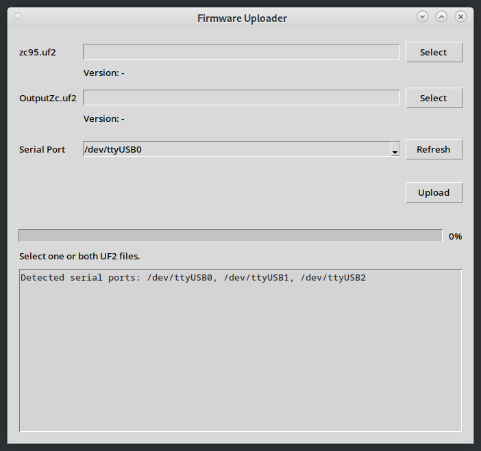

# Updating the firmware

The quickest way to update the firmware will always be the same process as originally flashing it - i.e. pull out the Picos, hold down the button, connect to usb, release the button, then copy over the appropriate uf2 file and reinstall in the zc95 after it completes. 

As an alternative, from F/W 2.1 onwards, there is bootloader present which allows the firmware to be updated using a USB to Serial cable plugged into the 3.5mm serial socket, then using the firmware upload tool in this repo.

This won't be of any practical use until F/W v2.2 as v2.1 will still need to be installed by direct connection to the picos via USB.

## Updating via serial

Download the most recent firmwares (zc95.uf2 and OutputZc.uf2) from the [Releases](https://github.com/CrashOverride85/zc95/releases) page.

From the [`misc/firmware_uploader`](../misc/firmware_uploader/) directory, run `python3 -m firmware_uploader.ui`. You might need to either run `pip install .` in that directory first, or if on Debian/Ubuntu, something like `apt-get install python3-xmodem python3-serial python3-tk`.

The tool should appear:

Select the zc95.uf2 and OutputZc.uf2 files downloaded from the [Releases](https://github.com/CrashOverride85/zc95/releases) page, and pick the serial port of the USB <> Serial cable.

**Note**: Versions 2.0 and older will be rejected with the error `xxx.uf2 is not a valid firmware image`.

Connect the zc95 leaving it switched off, click `Upload`, _then_ turn on the zc95. The upload should start within a few seconds. Expect the process to take 4-5 minutes, and for the first 1% to take longer than it should. 
All going well, after it completes you should get a `Firmware upload completed successfully` message, and the new firmware started on the ZC95.

If the update process gets interrupted, the zc95 likely won't boot, or will show an error. Just try again - this upload process can't update the bootloader, so it'll still be present to have another go.
